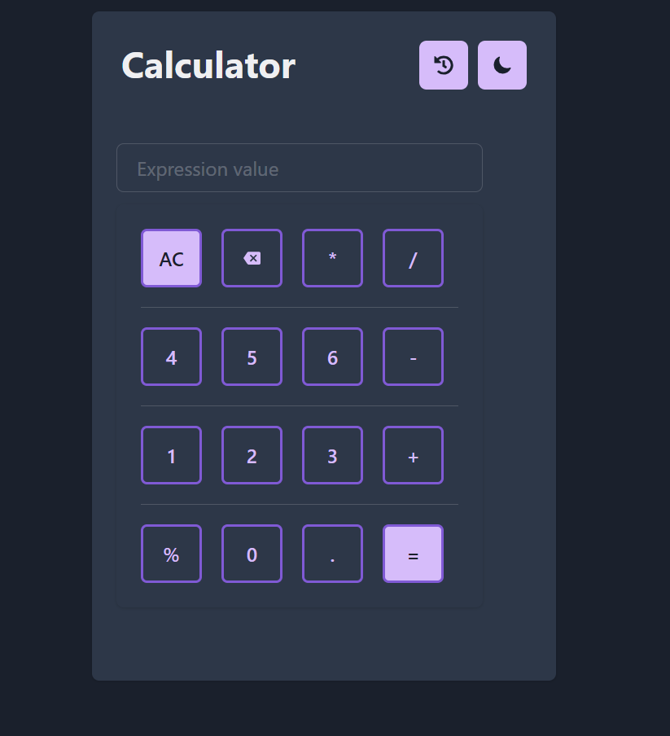

### 🤗🤗 Happing Coding 🤗🤗

#### 🌐 React todo app 🌐

### Description

- This is a simple calculator app, created using react and chakra UI.This application includes all the things
- In this we have dark mode and light mode and even theming also.
- Error Handling.
- View History
- Remove history -> While removing history, we are asking for confirmation.

### Sample Theme

# 
Blue

 
 

# Purple

 
 

# Teal

 
 
 

### Demo URL

- https://vardhan-venkata.github.io/react-simple-calculator/

## Packages used

- react
- react-dom
- react-scripts
- chakra UI
- react-icons

### Usage

- Clone the repository
- Do npm install to install all the dependencies
- create a .env file
- Add REACT_APP_COLOR_SCHEME = "YOUR_REQUIRED_COLOR" in the env file, if you forgot to add, it will fallback to the "blue"
- Run the project using npm run start

### How can I appreciate this repo? 💙

- By giving this repo a 🌟
